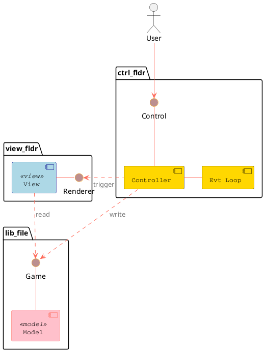

# Design of the game

## Goal

This is going to be a very simple Game for adukts and children: Memory trains your short term memory: The game
starts with randomly placing pairs of cards with pictures (in this first version just numbers) in a rectangular
matrix (currently 8x8). The picture is downwards and you only see the backside.
The players take turns. So the game must allow to enter the number of players. The players choose two cards when
it is their turn. These two cards are then shown openly. If they show the same picture the player found a pair
and keeps them. Otherwise the players should memorize which card was where. The cards get turned back around so
that you only see the backside and it is the next players turn.
When there are no cards anymore on the table, the game is over. The player with the most cards wins.

## Long term extension ideas

- Make it possible to create your own card sets
- Play over the network with other players (there could be multiple players at each participating computer)
- Have an AI player with different levels of intelligence (or memory capacity).

## Highlevel Design

- We use the model-view-controller pattern
- The model is realized in the struct Game (found in lib.rs)
- The view is realized in the struct Renderer in the file board_view.rs
- The controller is realized in the struct Control in file controller.rs

Game hosts all game logic and data (players, card deck, board).

Renderer hosts all functions to display the game state on the screen.

Control hosts all functions to respond to input from the user (mouse click on a card should reveal the card). It
connects the input to the Game state and calls the game logic functions accordingly.
This struct (was about to call it object or class) collects the events from the event loop and handles them by
calling the corresponding game logic.

