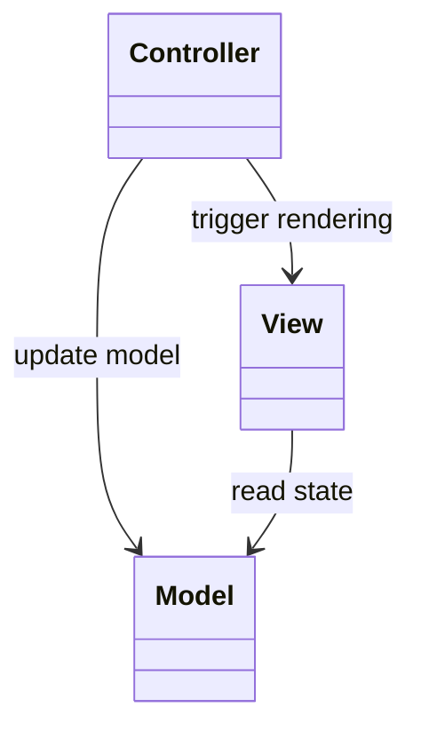
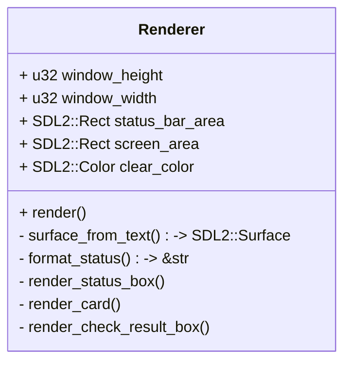

# Memory Game Architecture

The core library this game is build upon is the SDL2 library. This library provides simple functions to present things on a canvas:

- 2D objects such as rectangles, circles, triangles, etc.
- textures (which must also be used to render text)

It also provides a simple API to get events (user input in terms of mouse clicks or key presses). The typical way of operation is to query the event buffer for new events, handle the events (e.g. by drawing something) and finally calling canvas.present() to update the screen with the new rendering.

The game follows the model-view-controller pattern. The model holds the game status is practically using the memory game domain model for design. The class `Game` holds it all together and provides the main API used by the controller and the view to drive the game forward or to represent the state on the screen.

The controller reacts to user input (mainly mouse clicks) and updates the game state accordingly. It has a class `Control` which implements a method `handle_mouse_click()` which drives the game status forward. The class also has a method `run()` which implements the control loop. This control loop calls `handle_mouse_click()` when it sees a mouse click event. It also calls the view's render method as well as `canvas.present()`.

The view queries the game for its current state and updates the screen accordingly. The view is realized by the class `Renderer`. It's only public API is the method `render()` which is called by the class `Control` in the method `run()` as described above. The view is not the largest but most complex class because it has to deal with unpleasant coordinates calculations and rendering stuff to draw all the cards on the screen.



## The Model component

The model looks as follows:

```mermaid
%%{init: {"flowchart": {"defaultRenderer": "elk"}} }%%
---
title: Game Model Class Diagram
---
classDiagram

class Player{
    +name
    +collected_cards
    +new()
}

class Card{
    +id
    +card_type
    +title
}

class Deck_stereotype{
    + vec~Card~ cards
}


class Field{
    +height
    +width
    +field
    +new()
    +card_idx()
    +clear_field()
    +place_deck()
}

class Game{
    +state
    +last_guess_success
    +rounds_counter
    +field
    +players
    +deck
    +current_player_id
    +num_clicked
    +clicked_card1
    +clicked_card2
    +new()
    +add_player()
    +reset()
    +card_at()
    +open_card()
    +check_guess_current_player()
    +check_game_over()
    +next_player()
}

Game "1" o-- "1" Field:field
Game "1" o-- "*" Player:players
Game "1" o-- "1" Deck_stereotype:deck
Game "1" ..> "1" Player:current_player

Field "1" ..> "*" Card:index 
Deck_stereotype "1" *-- "*" Card:cards
```

The game model runs a state machine. The states are defined by the enum `GameState`. It has the following startes:

- StartGame
- StartSelectCards
- FirstCard
- SecondCard
- NextUser
- GameOver

The class `Game` has an attribute state that holds the game state. The following diagram shows the state transitions.

```mermaid
%%{init: {"flowchart": {"defaultRenderer": "elk"}} }%%
---
Game state transitions
---
stateDiagram-v2

[*] --> StartGame : reset()
StartGame --> FirstCard : open_card()
FirstCard --> SecondCard : open_card()
SecondCard --> NextUser : check_guess_current_player()
NextUser --> NextUser : check_game_over()
NextUser --> GameOver : check_game_over()
NextUser --> StartSelectCards : next_player()
StartSelectCards --> FirstCard : open_card()
GameOver --> StartGame : reset()
```

Note that the Field contains a 2D array with card ids. This 2d array is filled with ids in random order (shuffle).

## The Controller component

The Controller is the component that runs the main thread in a loop until the application terminates. That loop is realized in the function `run()`.  It is called from the function `main()` in `main.rs`.

Run does the following tasks:

```mermaid
---
Control flow of the main thread in method run()
---

flowchart TD

start(Start)
get_window[get a window from SDL2]
get_canvas[get drawing canvas from SDL2]
init_view[initialize the View by instantiating Renderer and pass in Canvas]
while_running{while running}
for_all_evts{for all
             SDL2 events}
evt_is_quit{evt == quit?}
running_false[running = false]
evt_is_mouse{evt == 
             mouse_click?}
handle_mouse_click["handle_mouse_click()"]
render["view.render()"]
canvas_present["canvas.present()"]
ok["ok()"]

start --> get_window
get_window --> get_canvas
get_canvas --> init_view
init_view --> while_running
while_running -- true --> for_all_evts
for_all_evts --> evt_is_quit
for_all_evts --> evt_is_mouse
for_all_evts -- queue empty --> render
evt_is_quit --> running_false
running_false --> for_all_evts
evt_is_mouse --> handle_mouse_click
handle_mouse_click --> for_all_evts
render --> canvas_present
canvas_present --> while_running
while_running -- false ----> ok

style start fill:#22f,stroke:#333,stroke-width:4px
style ok fill:#22f,stroke:#f66,stroke-width:2px,color:#fff,stroke-dasharray: 5 5
style handle_mouse_click fill:#59f,stroke:#22f,stroke-width:4px
style while_running fill:#224,stroke:#333,stroke-width:4px
style for_all_evts fill:#224,stroke:#333,stroke-width:4px
style evt_is_quit fill:#123,stroke:#333,stroke-width:4px
style evt_is_mouse fill:#123,stroke:#333,stroke-width:4px
```



The key function in the flow is the `handle_mouse_click()` call. This method of the `Control` class drives the state machine of the game forward. It uses the function `calculate_card_coord_from_mouse_click()` to translate the x, y pixel coordinates of the mouse click to the column and row in the `Field` object. This, row/ column pair can then be used to look up the card at the clicked position.
It then checks the state of the game. Depending on the state it calls the corresponding method in the `Game` object to update the state based on the mouse click.

> Note that this could be refactored. Theoretically this is something that should be done by the `Game` class itself. The `Game` class should simply expose an function `trigger_state_change()` which does the corresponding stuff.

> Note that strictly speaking the functions for Initializing SDL2 and getting a Window as well as a Canvas could be interpreted as part of the View component. However, SDL2 is also key to the Controller because it has the event handling mechanism that allows for call backs for mouse clicks, etc. So, for the moment, I think I'm ok having it in the Controller.

## The View Component

The View Component has the class `Renderer` that holds all relevant code to display the state of the game on the screen. For this purpose it has the method `render()` which is called by the controller in the control loop in its method `run()`. 

The class looks like this:



The `Renderer` splits the screen into two sections: 

1. The `screen_area` which is where the cards are rendered
2. The `status_bar_area` which is where the current game state is being rendered (printed as text).

Note that the total window size is specified by the attributes `window_height` and `window_width`. Both areas must fit into the window dimensions, otherwise there is no limitation. At the moment I'm putting the status bar below the screen_area, but this can change.

The `Renderer::render()` basically draws both areas: 

It first draws all the cards to the Canvas inside the screen_area. The functions are written so that the cards fit into the given area.

It then renders the status bar.

If the game state is `NextUser` then it also prints a message right inside the screen_area which states if the last click was a success (i.e. a pair of cards was found) or not.

```mermaid
---
Flowchart of method ModelView::render()
---

flowchart TD

start(Start)
clear_screen[clear screen_area]
calc_card_dim[calculate card dimensions]

for_each_row_col{for each row and col}
has_card{"field[row,col]
         has card"}
render_card[render card]
render_status_box["render_status_box()"]
state_is_next_user{state == NextUser?}
render_check_result_box["render_check_result_box()"]
ok["ok()"]


start --> clear_screen
clear_screen --> calc_card_dim
calc_card_dim --> for_each_row_col
for_each_row_col --> has_card
for_each_row_col -- done ----> render_status_box
has_card -- true --> render_card
has_card -- false --> for_each_row_col
render_card --> for_each_row_col
render_status_box --> state_is_next_user
state_is_next_user -- true --> render_check_result_box
state_is_next_user --> ok
render_check_result_box -- false --> ok

style start fill:#22f,stroke:#333,stroke-width:4px
style ok fill:#22f,stroke:#f66,stroke-width:2px,color:#fff,stroke-dasharray: 5 5
style for_each_row_col fill:#224,stroke:#333,stroke-width:4px
style has_card fill:#123,stroke:#333,stroke-width:4px
style state_is_next_user fill:#123,stroke:#333,stroke-width:4px
```



Finally, a short explanation of the other method of the Renderer:

- `surface_from_text(text) -> SDL2::Surface` The way to render text on a cnvas is via a Texture. You have to print the text into a surface and then create a texture from that surface. This method creates the surface from the given text.
- `format_status(game_state) -> &str` This method creates a text to be printed into the status bar based on the current state of the game.
- `render_status_box(game)` This method renders the status bar. It clears the status bar area and then creates a string with the current state (round number, name of current player, points, and game status text), creates a surface nd texture from it and renders it to the canvas.
- `render_card(card, y, x, card_height, card_width)` This method renders the **open** card into the screen at the given position. For this it creates a surface/ texture, calculates the middle position in the card and renders it there.
- `render_check_result_box(game)` This method renders a text on the screen right over the card field. If the last move was a success (i.e. the opened cards were a pair witht the same id) it prints a "success" message other wise a "no success" message.

All calculations of positions are a pain in the neck but I have no better idea how to do it.

*Astonishingly difficult.*
